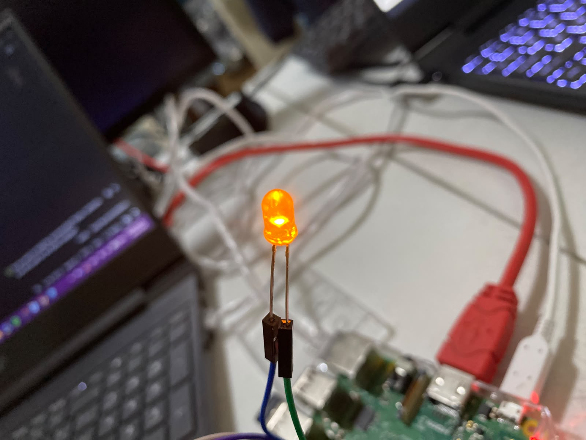
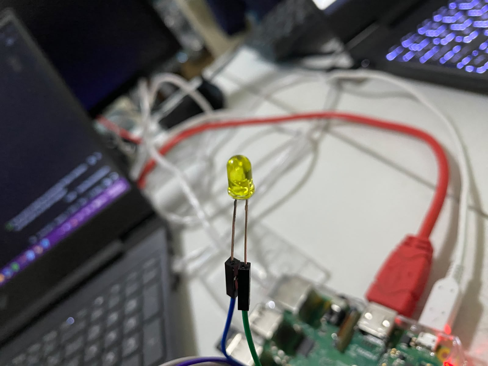

# P1_LedBlink
# Práctica: Parpadeo de LED con GPIO en Raspberry Pi

Este proyecto consiste en la creación de un parpadeo básico (Blink) utilizando una Raspberry Pi y un LED. La práctica se realizó de forma remota: el entorno de desarrollo fue una máquina virtual con **Fedora** en **VirtualBox**, desde la cual se estableció una conexión **SSH** hacia la Raspberry Pi para ejecutar el código en Python. Se presentan dos métodos de programación: usando la numeración BCM y la numeración física (BOARD).

## 🛠️ Requisitos y Entorno

*   **Cliente:** Fedora Linux (Máquina Virtual en VirtualBox).
*   **Servidor/Dispositivo:** Raspberry Pi (con sistema operativo basado en Linux).
*   **Lenguaje:** Python 3.
*   **Librerías:** `RPi.GPIO`
*   **Conexión:** Red local vía SSH.

## 🔌 Conexiones de Hardware (Pines)

Según el código y la configuración, las conexiones físicas son las siguientes:

| Archivo | Modo de Numeración | GPIO (BCM) | Pin Físico | Función |
| :--- | :--- | :--- | :--- | :--- |
| `blinkBCM.py` | BCM | GPIO 18 | Pin 12 | Salida (Output) |
| `blinkPIN.py` | BOARD | N/A | Pin 12 | Salida (Output) |

*Nota: El Pin físico 12 corresponde al GPIO 18 en el modo BCM.*

## 🚀 Pasos Realizados (Comandos)

A continuación se detallan los comandos utilizados en la terminal para conectarse a la Raspberry Pi y preparar el entorno.

### 1. Conexión SSH
Desde la terminal de Fedora, nos conectamos a la Raspberry Pi (usuario `mar` e IP `192.168.50.83`):

    ssh mar@192.168.50.83

### 2. Creación y Edición de los Scripts
Dentro de la Raspberry Pi, se crearon los archivos de código utilizando el editor de texto `nano`:

    sudo nano blinkBCM.py  # Para editar el código con numeración BCM
    sudo nano blinkPIN.py  # Para editar el código con numeración física (BOARD)

### 3. Ejecución de los Scripts
Se ejecutaron los archivos con permisos de superusuario (necesarios para acceder a los GPIO):

    python3 blinkBCM.py    # Para ejecutar el parpadeo en modo BCM
    python3 blinkPIN.py    # Para ejecutar el parpadeo en modo BOARD

## 📋 Explicación del Funcionamiento

El proyecto consta de dos scripts con lógicas ligeramente diferentes:

### `blinkBCM.py` (Modo BCM)
1.  **Configuración:** Se importan las librerías `RPi.GPIO` y `time`. Se define la variable `LED_PIN = 18`.
2.  **Inicialización:** Se configura el modo de numeración **BCM** (`GPIO.setmode(GPIO.BCM)`) y se establece el pin 18 como salida (`GPIO.OUT`), inicializándolo en estado bajo (`GPIO.LOW`).
3.  **Bucle Infinito (`while True`):**
    *   **Encendido:** Se pone el pin en alto (`GPIO.HIGH`) y se imprime "LED ENCENDIDO" en consola. Se espera 1 segundo.
    *   **Apagado:** Se pone el pin en bajo (`GPIO.LOW`) y se imprime "LED APAGADO" en consola. Se espera 1 segundo.
4.  **Manejo de Errores:** Se utiliza un bloque `try...except KeyboardInterrupt` para detectar cuando el usuario presiona `Ctrl+C`. Al hacerlo, el programa sale del bucle de forma limpia.
5.  **Limpieza (`finally`):** Independientemente de cómo termine el script, se ejecuta `GPIO.cleanup()` para liberar los pines GPIO y asegurarse de que no queden en un estado de alto voltaje, evitando daños al hardware.

### `blinkPIN.py` (Modo BOARD)
1.  **Configuración:** Se importan las librerías `RPi.GPIO` y `time`. Se define la variable `LED_PIN = 12` (haciendo referencia al pin físico).
2.  **Inicialización:** Se configura el modo de numeración **BOARD** (`GPIO.setmode(GPIO.BOARD)`) y se establece el pin 12 como salida (`GPIO.OUT`), inicializándolo en estado bajo (`GPIO.LOW`).
3.  **Bucle con Contador (`while contador < 10`):**
    *   **Parpadeo Rápido:** Se utiliza un bucle `for` para repetir 3 veces el encendido y apagado del LED con una pausa de 0.2 segundos entre cada estado.
    *   **Pausa Larga:** Después de los 3 parpadeos, se realiza una pausa de 1 segundo.
    *   **Contador:** Se incrementa la variable `contador` en 1 y se imprime el progreso en consola (ej. "Ciclo 1/10 completado").
4.  **Manejo de Errores y Limpieza:** Al igual que el script BCM, utiliza `try...except KeyboardInterrupt` y un bloque `finally` con `GPIO.cleanup()` para apagar el sistema correctamente.

## 📸 Evidencia de Ejecución

En la terminal se observó el siguiente flujo para ambos scripts:

### Ejecución en Modo BCM
1.  Creación y edición del script `blinkBCM.py`.
2.  Ejecución del script con `python3 blinkBCM.py`.
3.  Impresión en consola alternando: `LED ENCENDIDO` y `LED APAGADO`.

4.  Interrupción manual con `Ctrl+C` y mensaje de limpieza exitosa: `GPIO limpiado. Programa finalizado.`

### Ejecución en Modo BOARD (Físico)
1.  Creación y edición del script `blinkPIN.py`.
2.  Ejecución del script con `python3 blinkPIN.py`.
3.  Impresión en consola del ciclo: `Ciclo 1/10 completado`, `Ciclo 2/10 completado`, etc.

4.  Interrupción manual con `Ctrl+C` y mensaje de limpieza exitosa: `Sistema apagado correctamente`.

### Conexiones Físicas
A continuación se muestran las conexiones físicas realizadas en la Raspberry Pi para ambos métodos:

8. Encendido de LED exitoso en ambos modos.

