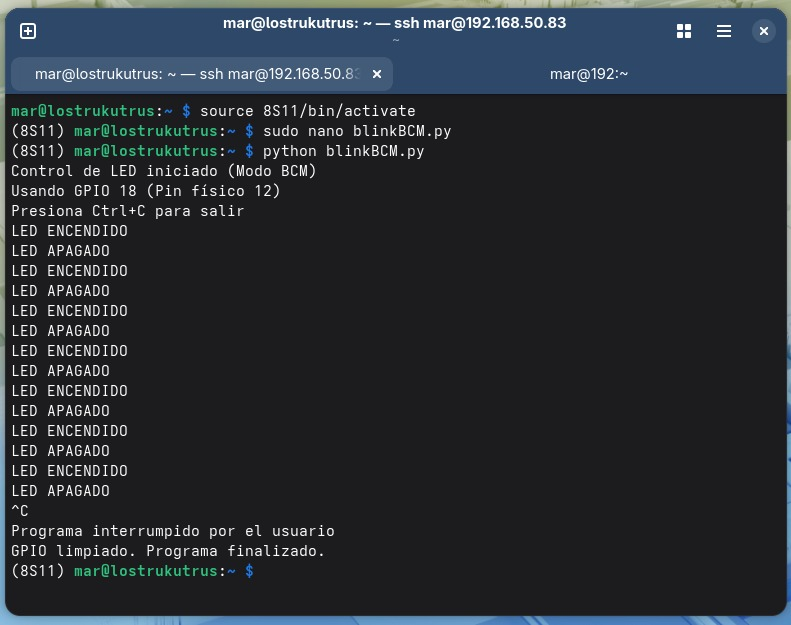
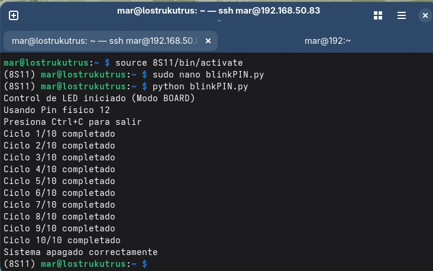
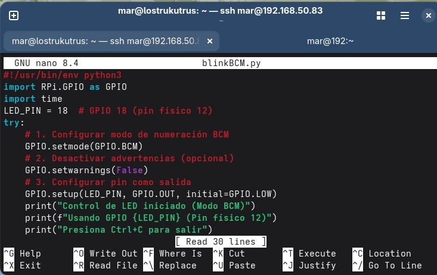
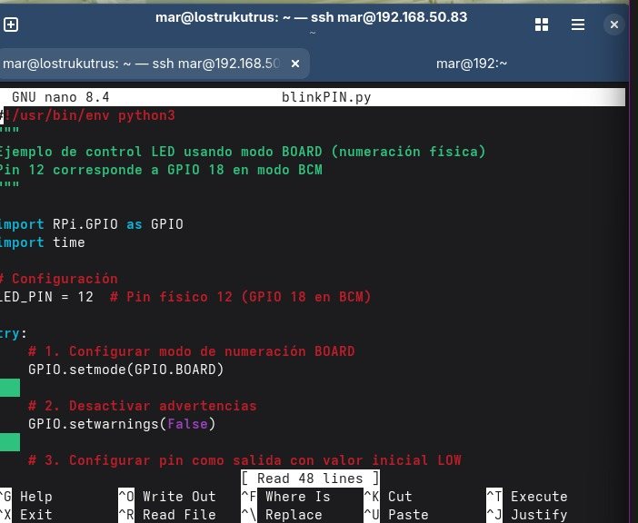

# P1_LedBlink
## 🖼️ Imágenes del proyecto

Aquí puedes ver algunas capturas de la configuración y ejecución:

### Configuración en Terminal (BCM)

### Configuración en Terminal (PIN)

### Conexiones Físicas
A continuación se muestran las conexiones físicas realizadas en la Raspberry Pi:

